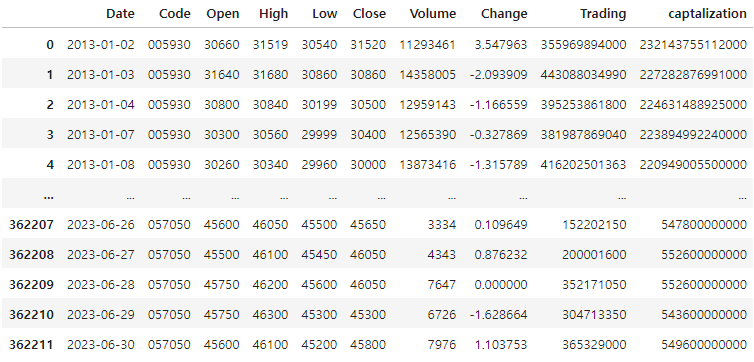
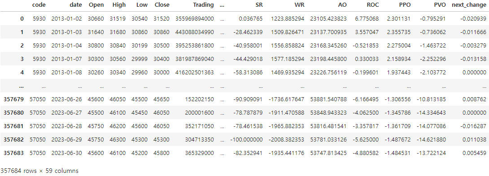
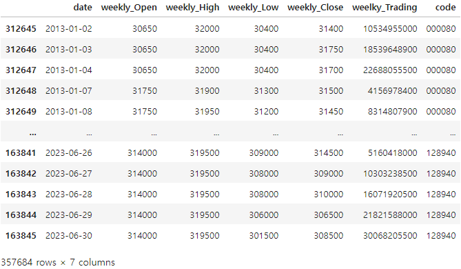
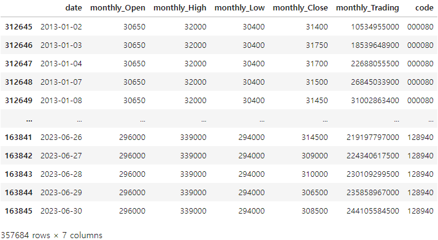

## 프로젝트 : 주가 데이터를 활용한 일/주/월 모델 통합 인공지능 모델링 분석

- 기간 : 2023.08.07 ~ 2023.08.27
- 팀원 : 이승연, 임소연, 임형섭, 곽병찬, 김한호
- 분석 도구 : Python

***

## 1. 프로젝트 개요
### 1-1 ) 프로젝트 목적
- 주가 시게열 빅데이터를 활용한 

### 1-2 ) 프로젝트 필요성 
-

***
### 1-3) 데이터 정의
- 

## 2. 사용 라이브러리  
##### 2-1 ) numpy
설치 : ``` !pip install numpy ```<br>
버전 : 1.24.3 <br>

##### 2-2 ) pandas  
설치 :  ``` !pip install pandas ```<br>
버전 : 2.0.3

##### 2-3 ) tdqm
설치 :  ``` !pip install tqdm ```<br>
버전 : 4.64.1

##### 2-4 )  datetime
설치: 파이썬의 내장 라이브러리이므로 별도 설치 없이 사용 가능

##### 2-5 )  warning
설치: 파이썬의 내장 라이브러리이므로 별도 설치 없이 사용 가능

##### 2-6 )  pykrx
설치: ``` !pip install pykrx ``` <br>
버전 : 1.0.45<br>
설명 : 한국 주식 시장 데이터 조회를 위한 라이브러리

##### 2-7 )  ta
설치: ``` !conda install -c conda-forge ta ``` <br>
버전 : 0.10.2<br>
설명 : 다양한 기술적 지표를 계산하여 주가 데이터와 관련된 정보를 얻을 수 있는 라이브러리

##### 2-8 ) matplotlib
설치: ``` !pip install matplotlib ``` <br>
버전 : 3.6.2

##### 2-9 ) seaborn 
설치: ``` !pip install seaborn ``` <br>
버전 : 0.12.2
***

## 3. 코드 실행

### 3-1 ) EDA 
! 실행하기 전에 라이브러리 import 필수
- 파일명 : 2.EDA
- 기초 통계값, 주가 분포, 이상 종목 시각화 등
- 기간 : 2013년 1월 1일 ~ 2023년 6월 30일
- raw_data : 2011년 이전 상장된 kospi200의 시가,고가,저가,종가,거래량,등락률, 거래대금, 시가총액이 포함된 데이터

#### 데이터 통계값 확인
- min : 주가와 거래량, 거래대금 열에 0값이 존재함 -> 개별 종목 확인 필요
- std : kospi200 종목 간의 가격 표준편차가 비교적 큼을 확인 -> 주가 분포 확인 필요


#### 데이터 주가 분포 확인 ( 이미지 : 스케일링 전 -> 후 하나로 넣기)
- 139개 종목의 분포를 확인한 결과, 주가의 분포가 넓게 퍼져 있음
- 여러 종목의 주가를 직접 비교하기 어려우므로 스케일링을 통해 주가 데이터를 일정 범위로 변환 필요
- 전날 종가로 나눈 후 로그 변환

#### 다음날 등락률 & 타겟값 분포 확인( 히스토그램 분포 -> 원그래프 넣기)
- raw data에는 다음날 등락률이 존재하지 않으므로, day_data에서 next_change 값 추출
  ##### 임계값 설정 방법
  - 방법 1 : 통계적 방법(평균, 표준편차)을 사용한 임계값 설정
  - 방법 2 : 히스토그램 막대 높이에 따른 임계값 설정
  ##### 임계값에 따른 타겟값 이진화
  - 데이터 불균형 존재 -> 가중치 파라미터 조정 필요
  
#### 삼성전자 주가 시각화 (사진 크기 줄이고 넣기)
- 액면분할로 인한 거래정지로 가격정보가 0으로 나타난 삼성전자 시각화
- 거래정지 기간을 제외하고, 분석 진행

#### 종가와 시가총액의 관계 ( 사진 크기 줄이고 하나에 넣기)
- 종가와 시가총액이 같은 양상으로 움직이면서, 주식 가격 상승이 기업의 가치 증가와 관련있다고 판단
- 시가총액 변수를 추가하여 분석 진행

### 3-2 ) 데이터 구축
! 실행하기 전에 라이브러리 import 필수
- 파일명 : 1. 데이터 구축
#### 일별 raw 데이터
- 기본 데이터를 pykrx라이브러리를 이용해서 구축
  - 정보를 가져올 코스피 종목 가져오기 전부 실행 후 실행 (kospi200 = result_df['Symbol']까지)
  - 실행시간 약 50분 소요 -> 데이터 파일 따로 구글 드라이브로 공유
</img><br/>

#### 일별 보조지표 추가 데이터<br>
- 기본 데이터에 보조지표를 계산하여 추가
  - 보조지표 가져오기 함수 실행 후 일별 데이터 생성(보조지표 추가)를 실행
  - 후에 day_data.csv로 저장까지 실행
</img><br/>

#### 주별 데이터
- 일별 데이터를 기반으로 생성한 주별 데이터를 일별로 쌓이도록 한 뒤 이동평균선을 계산하여 추가
  - 함수로 만들어 WD(일별데이터)로 실행하면 결과값이 나옴
  - 결과값 중 필요한 date, Open, High,	Low,	Close,	Trading,	code만 저장하고 weekly로 칼럼명 변경
</img><br/>

#### 월별 데이터
- 일별 데이터를 기반으로 생성한 월별 데이터를 일별로 쌓이도록 한 뒤 이동평균선을 계산하여 추가
  - 함수로 만들어 MD(일별데이터)로 실행하면 결과값이 나옴
  - 결과값 중 필요한 date, Open, High,	Low,	Close,	Trading,	code만 저장하고 weekly로 칼럼명 변경
</img><br/>
